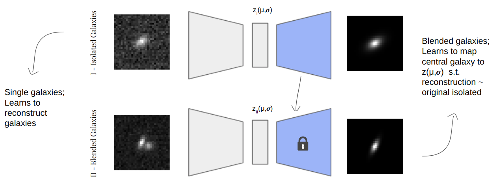

# Deblender-VAE-Euclid

This repository contains notebooks for deblending galaxy images for the upcoming Euclid survey in the VIS band. Two VAE networks are used to perform deblending. The first VAE (see ) reconstructs isolated
galaxy images. The second VAE (see  
) uses the first VAE’s decoder with fixed weights (which has
learnt to generate an isolated image from a latent space) and an encoder that tries to map the
blended galaxy input image to a point in latent space as though the galaxy in the centre of
the blended image were isolated, thus effectively reconstructing the real shape of the blended
object.

References
-------------------------
https://github.com/LSSTDESC/DeblenderVAE

Contributors
-------------------------
Lavanya Nemani lavanya.nemani@inaf.it
Fernando Caro fernando.caro@inaf.it
Emiliano Merlin emiliano.merlin@inaf.it
Adriano Fontana adriano.fontana@inaf.it
